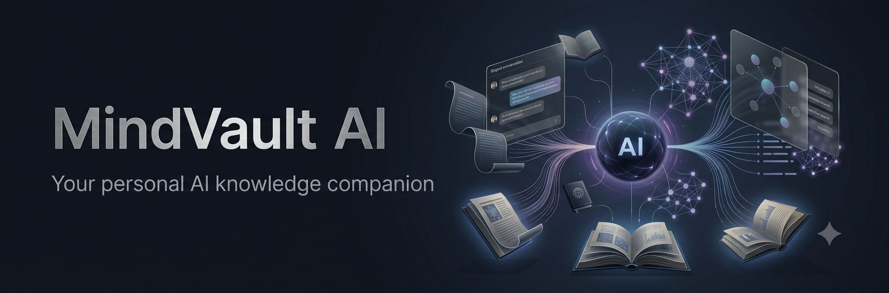
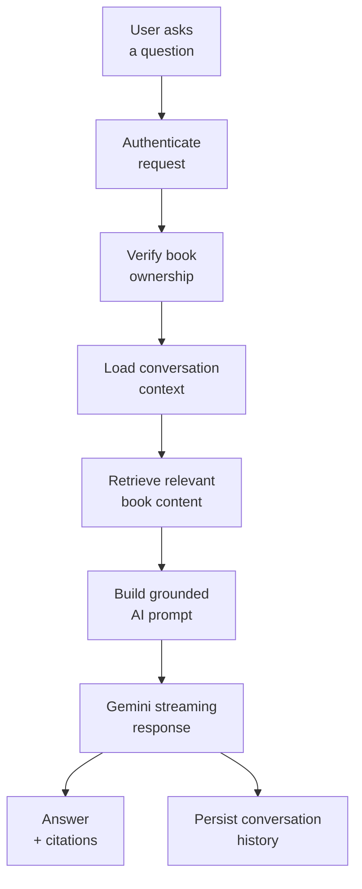
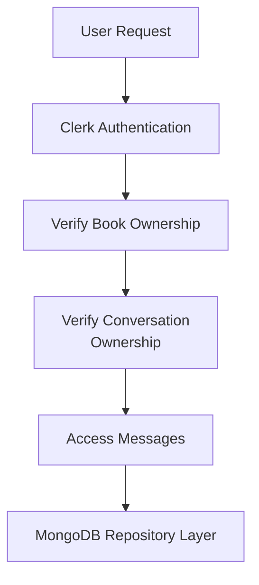
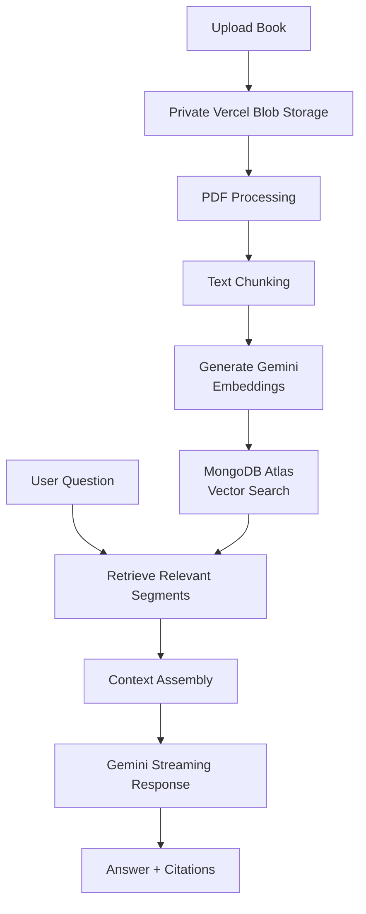

<p align="center">
  
</p>

<h1 align="center">MindVault AI</h1>

<p align="center">
  Your personal AI knowledge companion for books and documents.
</p>

<p align="center">
  Upload your knowledge. Ask questions. Get grounded AI answers from your own content.
</p>

## Overview

**A private, AI-powered knowledge workspace for the books and documents that matter to you.**

MindVault AI turns uploaded PDFs into a searchable personal library. Users can upload books privately, open a protected book details dashboard, interact with their content through grounded AI chat, and create AI-generated learning materials from the same document foundation.

## Features

- Clerk-based user authentication
- Private PDF and book uploads
- Ownership-isolated document access
- PDF processing, text extraction, and chunking
- BookSegment storage for retrieval-ready document segments
- Gemini embedding generation
- MongoDB Atlas Vector Search over existing BookSegment embeddings
- Book-scoped Retrieval Augmented Generation (RAG)
- Streaming AI responses with citations
- Persistent, book-scoped conversations
- Conversation sidebar with create, select, rename, and delete actions
- Conversation summaries and bounded multi-turn memory
- Knowledge workspace with AI summaries and key takeaways
- Grounded flashcards, quizzes, and mind maps
- Generation progress, failure recovery, and artifact regeneration
- Protected in-app PDF viewing
- Book details dashboard
- Light, dark, and system theme support

## How It Works

```text
Upload document
  -> Private Vercel Blob storage
  -> PDF processing
  -> Text chunking
  -> Gemini embedding generation
  -> MongoDB Atlas Vector Search
  -> Relevant context retrieval
  -> Gemini generation
  -> Answer with citations
```

Uploaded documents stay private. Access is controlled through Clerk authentication and server-side ownership checks before document files, book metadata, or vector-search results are returned.

## Conversation Intelligence

Conversation features are implemented and book-scoped. Each conversation belongs to a user and a selected book, and chat history persists after page reloads.

Implemented conversation capabilities:

- Persistent conversations
- Book-scoped conversation history
- Conversation sidebar
- Create, select, rename, and delete conversations
- Message persistence
- Multi-turn conversations
- Conversation summaries
- Bounded conversation memory
- Recent-message context
- Persistent chat history after reload
- Retrieval on every question

User-level flow:

```text
User Question
  ->
Conversation Context Loaded
  ->
Relevant Book Content Retrieved
  ->
Grounded Prompt Created
  ->
Gemini Streaming Response
  ->
Conversation History Saved
```

Conversation memory supports continuity, but it does not replace retrieval. Every question still performs document grounding against the selected book.

## Technology Stack

| Category       | Technologies                                                           |
| -------------- | ---------------------------------------------------------------------- |
| Frontend       | Next.js 16 App Router, React 19, TypeScript, Tailwind CSS, shadcn/ui   |
| Authentication | Clerk                                                                  |
| Database       | MongoDB Atlas, Mongoose                                                |
| Storage        | Vercel Blob private storage                                            |
| AI             | Gemini embeddings, Gemini generation, MongoDB Atlas Vector Search, RAG |
| Document tools | unpdf, react-pdf                                                       |

## Architecture

MindVault AI follows a feature-first architecture. Each domain owns its components, services, types, repositories, and related data access patterns. `app/` is reserved for routing and page composition, while shared technical infrastructure lives under `lib/`.

```text
app/
  Routing and page composition

features/
  books/
    Book lifecycle
    Upload processing
    Document management

  chat/
    Chat interface
    Streaming responses
    Message rendering
    Citations

  conversations/
    Conversation persistence
    Message history
    Summaries
    Conversation lifecycle

  knowledge/
    Summaries and learning artifacts
    Generation orchestration
    Artifact lifecycle and progress

  search/
    Retrieval
    Vector search
    Reranking

lib/
  Database infrastructure
  AI providers
  Configuration
  Shared utilities
```

### System Flow



### Security and Authorization Flow



This ownership model keeps private data isolated. Authentication happens first, then ownership is verified before any protected content is accessed.

### RAG Pipeline



The knowledge pipeline is book-scoped and uses the existing BookSegment embeddings. AI providers receive prepared context and do not query the database directly.

## Knowledge Intelligence

Knowledge Intelligence builds on the existing BookSegment foundation; it does not reprocess PDFs or regenerate embeddings. For whole-book coverage, it works through ordered segment batches and creates learning materials grounded in the uploaded content.

Implemented capabilities:

- AI summaries
- Key takeaways
- Flashcards
- Quiz generation with explanations
- Mind maps
- Artifact citations and source-segment provenance
- Requested, generating, completed, and failed generation states
- Generation progress tracking, retry support, stale-generation recovery, and regeneration

## RAG Architecture

The retrieval and generation flow is intentionally separated:

1. Book upload and PDF processing prepare the source text.
2. Text is chunked into BookSegments that preserve page and ordering metadata.
3. Embeddings are generated for those segments.
4. Retrieval uses MongoDB Atlas Vector Search against the stored BookSegment embeddings.
5. Ownership checks run before any private document data is accessed.
6. Gemini receives curated context and generates the response stream.
7. Citations are attached to the answer so users can trace the source material.

This keeps retrieval grounded, book-scoped, and independent from generation.

Knowledge regeneration preserves the last completed artifact while a separate `KnowledgeGeneration` tracks progress, retries, cancellation, and resumable batch checkpoints. The knowledge API returns `completedArtifact` and `activeGeneration`; duplicate active requests for the same user, book, and artifact type reuse the existing generation. AI accounting is recorded per generation-provider and embedding-provider attempt without storing prompts, source text, vectors, or secrets.

## User Experience

The current interface includes:

- A library experience for browsing uploaded books
- A book details page with status, metadata, and a protected PDF viewer
- A chat experience for asking questions about a selected book
- A persistent conversation sidebar for switching between threads
- Conversation history that survives page reloads

Existing screenshots:

### Home


### Add a Book


### Book Details


### Dark Mode


## Security and Privacy

Documents are private and owned by individual users. Clerk authentication and server-side ownership checks are enforced before protected files, books, conversations, or vector-search results are returned. Vercel Blob credentials remain server-side, and blob keys are stored in MongoDB rather than treated as public access URLs.

Books, conversations, messages, knowledge artifacts, and retrieval results are all scoped to the authenticated owner and selected book. Client-side controls support the experience, but protected operations are authorized on the server.

## Development Setup

### Prerequisites

- Node.js
- A MongoDB Atlas account and database
- A Clerk application
- A Gemini API key
- A Vercel Blob store configured for private document storage

### Installation

```bash
npm install
```

### Environment Variables

Create a `.env.local` file and configure the required values:

```env
# MongoDB Atlas database connection string
MONGODB_URI=

# Clerk authentication
NEXT_PUBLIC_CLERK_PUBLISHABLE_KEY=
CLERK_SECRET_KEY=

# Google Gemini API key for embeddings and AI generation
GOOGLE_GEMINI_API_KEY=

# Vercel Blob private storage access token
BLOB_READ_WRITE_TOKEN=
```

- Do not commit any credentials.
- Only variables prefixed with `NEXT_PUBLIC_` are exposed to the browser. Keep all other keys server-side.

### Run Locally

```bash
npm run dev
```

Open [http://localhost:3000](http://localhost:3000) in your browser.

### Production Checks

```bash
npm run lint
npm run build
```

## Roadmap

### Current

- Authentication
- Book uploads
- PDF processing
- Private storage
- Protected document access
- Vector search
- RAG chat
- Streaming responses
- Citations
- Conversation Intelligence
- Conversation UI
- Book details dashboard
- Library experience
- Persistent conversation history
- Conversation summaries and multi-turn memory
- Knowledge Intelligence
- AI summaries and key takeaways
- Flashcards, quizzes, and mind maps
- Artifact generation tracking and regeneration

### Next

- Multi-book chat
- AI Personas
- Voice Conversations
- Learning Plans
- Spaced Repetition

### Future

- Mobile
- Team Workspaces
- Shared Libraries
- Analytics
- Subscription Plans

## Engineering Principles

MindVault AI is built with SOLID principles, strict TypeScript, clean architecture, and a production-focused approach to privacy, maintainability, and scale.
