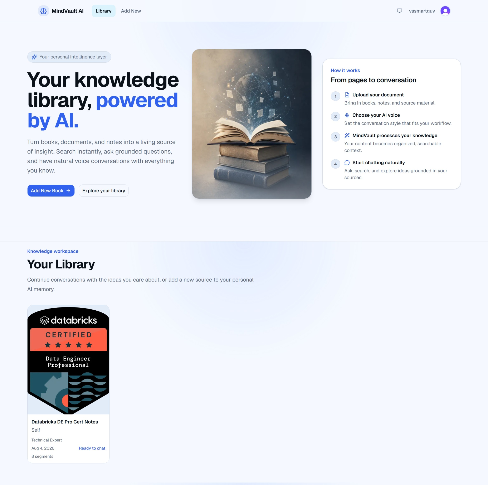

# MindVault AI

**A private, AI-powered knowledge workspace for the books and documents that matter to you.**

MindVault AI turns uploaded PDFs into a searchable personal library. Ask natural-language questions about a book, receive streamed answers grounded in its content, and follow citations back to the relevant source material—without treating your documents as public files.

## Features

- Clerk-based user authentication
- PDF book and document uploads
- Private, user-owned document storage with Vercel Blob
- PDF extraction and ordered text chunking
- Gemini-powered embedding generation
- MongoDB Atlas Vector Search over document segments
- Retrieval-Augmented Generation (RAG) for grounded answers
- Book-scoped AI conversations with streaming responses
- Citation-backed answers linked to source pages
- Protected in-app document viewing
- Light, dark, and system theme support

## How it works

```text
Upload document
      ↓
Private storage
      ↓
PDF extraction
      ↓
Text chunking
      ↓
Embeddings generation
      ↓
MongoDB Atlas Vector Search
      ↓
Relevant context retrieval
      ↓
Gemini response generation
      ↓
Answer with citations
```

MindVault preserves page and ordering metadata when it creates document segments. At question time, retrieval is scoped to the authenticated user's selected book; the generation layer receives only the prepared, relevant context.

## Technology stack

| Category       | Technologies                                                                        |
| -------------- | ----------------------------------------------------------------------------------- |
| Frontend       | Next.js 16 App Router, React 19, TypeScript, Tailwind CSS, shadcn/ui                |
| Authentication | Clerk                                                                               |
| Database       | MongoDB Atlas, Mongoose                                                             |
| Storage        | Vercel Blob private storage                                                         |
| AI             | Gemini embeddings, Gemini generation, MongoDB Atlas Vector Search, RAG architecture |

## Architecture

MindVault AI uses a feature-first, domain-driven structure designed to keep product code easy to evolve. UI composition, business services, repositories, and shared infrastructure have clear boundaries:

```text
features/
  books/   # upload, processing, storage, models, and book UI
  chat/    # chat UI, context construction, and conversation services
  search/  # embedding search and vector retrieval
lib/
  ai/      # replaceable embedding and generation providers
  db/      # database connection and shared persistence utilities
app/       # route composition and thin route handlers
```

Server Components are the default. Route handlers authenticate, validate, and manage HTTP transport while services coordinate workflows and repositories encapsulate database access.

## Security and privacy

Documents are private and owned by individual users. Clerk authentication and server-side ownership checks are enforced before protected files, books, or vector-search results are accessed. Vercel Blob credentials remain server-side; blob keys are stored in MongoDB and are never used as a substitute for authorization.

## Development setup

### Prerequisites

- Node.js
- A MongoDB Atlas account and database
- A Clerk application
- A Gemini API key
- A Vercel Blob store configured for private document storage

### Installation

```bash
npm install
```

### Environment variables

Create a `.env.local` file. The application reads these variables directly:

```env
MONGODB_URI=
GOOGLE_GEMINI_API_KEY=
BLOB_READ_WRITE_TOKEN=
```

Also configure the Clerk environment variables provided by your Clerk application. Refer to Clerk's Next.js setup documentation for the values appropriate to your instance; do not commit any credentials.

### Run locally

```bash
npm run dev
```

Open [http://localhost:3000](http://localhost:3000) in your browser.

## Roadmap

- Conversation history
- Multi-book search
- AI summaries
- Flashcards
- Quiz generation
- Mind maps
- Voice conversations
- Subscription limits
- Analytics

## Engineering principles

MindVault AI is built with SOLID principles, strict TypeScript, clean architecture, and a production-focused approach to privacy, maintainability, and scale.

## Screenshots

### Home



### Add a Book


### Book Details


### Dark Mode


